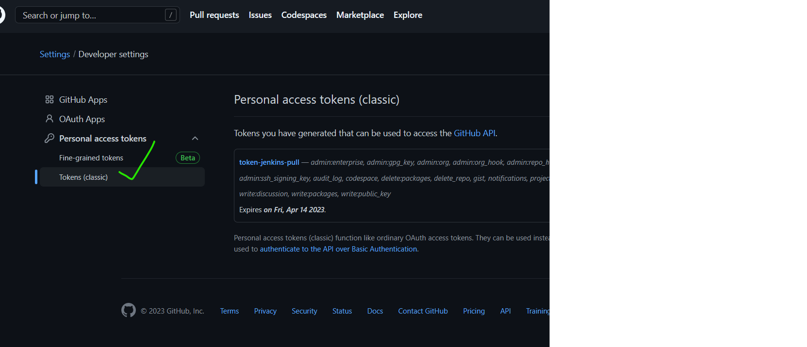
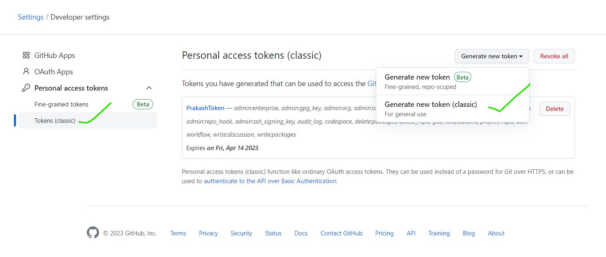
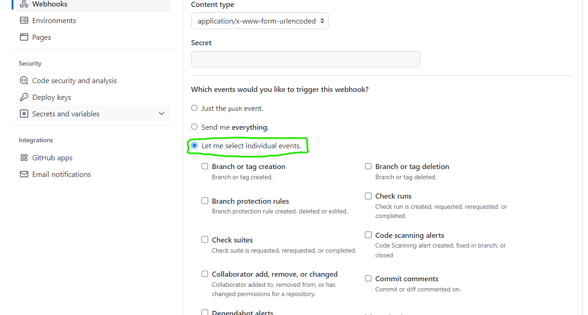

### Create a Jenkins pipeline which deploys spring petclinic application into some linux machine.
--------------------------------------------------------------------------------------------------
* Create two instances
      * Jenkins Master
      * Jenkins Node
* In Jenkins Master Machine Install openjdk-17-jdk and Jenkins on ubuntu OS.
* For Java 17 Installation
```
sudo apt-get update
sudo apt-get install openjdk-17-jdk -y
```
* For Jenkins Installation
```
curl -fsSL https://pkg.jenkins.io/debian-stable/jenkins.io.key | sudo tee \
  /usr/share/keyrings/jenkins-keyring.asc > /dev/null
echo deb [signed-by=/usr/share/keyrings/jenkins-keyring.asc] \
  https://pkg.jenkins.io/debian-stable binary/ | sudo tee \
  /etc/apt/sources.list.d/jenkins.list > /dev/null
sudo apt-get update
sudo apt-get install jenkins -y
```
* In Jenkins Node Machine Install openjdk-17-jdk and maven and asible on ubuntu OS.
* For Java 17, maven Installation
```
sudo apt-get update
sudo apt-get install openjdk-17-jdk maven -y
``` 
* For Ansible Installation
```
sudo visudo
sudo vi /etc/ssh/sshd_config
ssh-keygen
sudo passwd ubuntu
sudo vi hosts
ssh-copy-id ubuntu@<private-ip>
sudo apt-add-repository ppa:ansible/ansible
sudo apt update
sudo apt install ansible -y
ansible -i hosts -m ping all 
```
* sudo vi hosts => mention in that `localhost`
* For creation of s3 Bucket you should have to Install AWS CLI and AWS Configuration.
* For AWS Configuration we need Credentials of Access Key and Secret Key
    * we need IAM USER=> Create User =>Security Credentials => Create Access Key & Secret Key
```
sudo apt-get install unzip
curl "https://awscli.amazonaws.com/awscli-exe-linux-x86_64.zip" -o "awscliv2.zip"
unzip awscliv2.zip
sudo ./aws/install
```


* Create a folder and fork the Spring-Petclinic Project on your git repository
      * `https://github.com/Learningjenkinsqt/spring-petclinic.git` 
* clone the code and create Two branches `develop` and `release_1`
* open VS code and create a `Jenkinsfile` in that by using `develop` branch build a maven project.
```
pipeline {
    agent { label 'MAVEN_8' }
    stages {
        stage('vcs') {
            steps {
                git url: 'https://github.com/Learningjenkinsqt/spring-petclinic.git',
                    branch: 'develop'
            }
        }
        stage('package') {
            steps {
                sh 'mvn package'
            }
        }
        stage('post build') {
            steps {
                archiveArtifacts artifacts: '**/target/spring-petclinic-3.0.0-SNAPSHOT.jar',
                                 onlyIfSuccessful: true
                junit testResults: '**/surefire-reports/TEST-*.xml'
            }
        }
    }
}      
```
* Then Create a s3 Bucket by using below steps.
```
stage('craeting folder') {           
            steps {
                sh "mkdir -p /tmp/${JOB_NAME}/${BUILD_ID}"
                sh "cp -r **/spring-petclinic-*.jar /tmp/${JOB_NAME}/${BUILD_ID}"
                sh "aws s3 sync /tmp/${JOB_NAME}/${BUILD_ID} s3://reddyspcbucket --acl public-read-write"
            }
        }
```


* In `release_1` deploy the application
```
pipeline {
    agent { label 'MAVEN_8' }
    stages {
        stage('vcs') {
            steps {
                git url: 'https://github.com/Learningjenkinsqt/spring-petclinic.git',
                    branch: 'release_1'
            }
        }
        stage('package') {
            steps {
                sh 'mvn package'
            }
        }
        stage('post build') {
            steps {
                archiveArtifacts artifacts: '**/target/spring-petclinic-3.0.0-SNAPSHOT.jar',
                                 onlyIfSuccessful: true
                junit testResults: '**/surefire-reports/TEST-*.xml'
            }
        }
        stage('craeting folder') {           
            steps {
                sh "mkdir -p /tmp/${JOB_NAME}/${BUILD_ID}"
                sh "cp -r **/spring-petclinic-*.jar /tmp/${JOB_NAME}/${BUILD_ID}"
                sh "aws s3 sync /tmp/${JOB_NAME}/${BUILD_ID} s3://reddyspcbucket --acl public-read-write"
            }
        }
        stage('deploy') {
            steps {
                sh "ansible-playbook -i hosts ./springpetclinic.yml"
            }
        }
    }
}
```
* To download `spc jar` we can write a yaml file and Service file.
```yaml
  ---
  - name: Download jar file
    hosts: all
    become: yes
    tasks:
      - name: install spc
        get_url:
          url: 'https://reddyspcbucket.s3.ap-south-1.amazonaws.com/spring-petclinic-3.0.0-SNAPSHOT.jar'
          dest: /home/ubuntu
      - name: copy the service the file
        copy:
          src: springpetclinic.service
          dest: /etc/systemd/system/
          mode: "777"
      - name: daemon reload
        systemd:
          name: springpetclinic.service
          daemon_reload: yes
          state: started
          enabled: yes
```
```
[Unit]
Description=Mangae Java Service SPC

[Service]
Environment="JAVA_HOME=/usr/lib/jvm/java-17-openjdk-amd64"
WorkingDirectory=/home/ubuntu
ExecStart=java -jar spring-petclinic-3.0.0-SNAPSHOT.jar
Type=simple
Restart=on-failure
RestartSec=10

[Install]
WantedBy=multi-user.target
```
* In host file just give `localhost`


### jenkins job for merging pull requests into develop branch

* In our Jenkins we need to install `GitHub Pull Request Builder` Plugin. Open Jenkins Navigete to manage jenkins ==> Manage plugins => install `GitHub Pull Request Builder`
* Go to Github account => settings => Developer settings => Personal AccessToken selectc`lassic` => generate token and give permissions to that.



* By using that Personal AccessToken create a Token in Jenkins=>Manage Jenkins=>Credentials


* For Pull Request Create one Free style Jenkins project. 
   * For this project configuration


* In our main Git Repository we can create Webhooks

* For the steps [Refer Here](https://plugins.jenkins.io/ghprb/)




## Spring-petclinic workflow

#### For Day Build
* VCS (Version Control System) - We will able to get the developer (Spring-petclinic) code form the GITHUB.
* BUILD - Building the maven package and artifact to the maven.
* SCN (Static Code Analysis) - Here we will scan the code by using Sonarcube.
* Archive the artifacts and publish the JUNIT results.
* Copy the `Spc Jar file` to the required folder.

#### For Night Builds
* VCS (Version Control System) - We will able to get the developer (Spring-petclinic) code form the GITHUB.
* BUILD - Building the maven package and artifact to the maven.
* SCN (Static Code Analysis) - Here we will scan the code by using Sonarcube.
* Archive the artifacts and publish the JUNIT results.
* Upload the `Spc-Jar file` to the s3 bucket/ jfroj.
* By using ansible playbook we can deploy the code.
     * Download artifact from artifactory in required path
     * Create a service file and run the service file.
